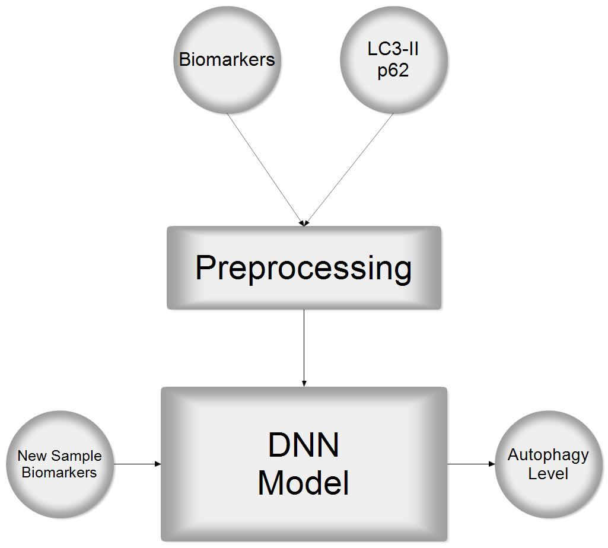

## Autophagy Estimation in Vivo by Using of a Black-Box Model

[**Mojtaba Moghadam**](https://github.com/mojtaba-moghadam) - *MSc of Biosystematics* - University of Zanjan

[**Sepand Haghighi**](https://github.com/sepandhaghighi) - *MSc of Computer Engineering* - Sharif University of Technology

### Introduction	

Autophagy is a cytoplasmic degradation system, which is important for starvation adaptation and cellular quality control. Recent advances in understanding autophagy highlight its importance under physiological and pathological conditions. However, methods for monitoring autophagic activity are complicated. [*[1]*](#references)

First, we review previous attempts to measure autophagy in vivo then we propose our method to estimate it by using a black-box system.

### Monitoring Autophagy Methods

1. LC3-II Flux by Immunoblotting [*[2]*](#references)
2. Accumulation of p62 in Tissues [*[3]*](#references)
3. GFP-LC3 Mice [*[2]*](#references)
4. mRFP-GFP-LC3 Mice [*[4]*](#references)
5. Mice that Express Mitophagy Reporter Proteins [*[5]*](#references)
6. GFP-LC3-RFP-LC3ΔG mice [*[6]*](#references)

Each method described above has its strengths and weaknesses. Most of them are invasive and cause serious damage to the sample.
It seems detection of autophagic flux by using LC3-II and p62 as indicators is the best way right now.

### Our Method
Here we propose a new method based on high-level biomarkers and a black-box model. This method tries to find the correlation between these markers and autophagy levels.

#### Characteristics of an Ideal Biomarker

- Easy to quantify in accessible clinical material

- Measurements are reliable, quick, reproducible, and cheap

- Abundance not subject to wide variation in the general population

- Unaffected by unrelated conditions and co-morbid factor

- Have strong relation to autophagy level

So we selected biomarkers that have been linked to lysosome activity in the previous works. [*[7]*](#references)

#### Biomarkers List

- Globotriaosylceramide (Gb3)
- Glucosylceramide
- Galactosylceramide
- Dermatan sulfate
- Heparan sulfate
- Hyaluronic acid
- Glycogen
- Free cholesterol
- Calbindin D
- Myostatin
- Chitotriosidase
- HbA1c
- Glucose level

#### Steps

1. Collecting a set of blood samples
2. Measuring p62 and LC3-II levels by using of **Western Blot** method for each sample [*[8]*](#references)
3. Measuring high-level biomarkers for each sample
4. Training a well-structured DNN on these data
	1. Input: Biomarkers level
	2. Target: A linear combination of LC3-II and p62 level

If there are enough samples and successful training of this deep neural network, we will reach a near real-time model that can estimate autophagy levels in vivo using high-level biomarkers.
The block diagram of this system is shown in the figure.

Fig1. System Block Diagram

#### Advantages

- Estimating autophagy levels in animals by using a real-time non-invasive method
- It's possible to increase model accuracy by adding some new biomarkers in the future
- It's possible to increase model accuracy by adding some new samples in the future

#### Disadvantages

- Data collecting
	- Measuring p62 and LC3-II by using of Western Blot method is a time-consuming procedure
	- The minimum amount of data required for the learning process of a deep neural network is not small
- At the time of writing this essay, there is ample evidence of a direct correlation between LC3-II and p62 and autophagy level, but there are also some concerns about its uncertainty [*[9]*](#references)

### References

<blockquote>1- Yoshii, Saori R., and Noboru Mizushima. "Monitoring and measuring autophagy." International journal of molecular sciences 18.9 (2017): 1865.</blockquote>

<blockquote>2- Mizushima, Noboru, et al. "In vivo analysis of autophagy in response to nutrient starvation using transgenic mice expressing a fluorescent autophagosome marker." Molecular biology of the cell 15.3 (2004): 1101-1111.</blockquote>

<blockquote>3- Komatsu, Masaaki, et al. "Homeostatic levels of p62 control cytoplasmic inclusion body formation in autophagy-deficient mice." Cell 131.6 (2007): 1149-1163.</blockquote>

<blockquote>4- Hariharan, Nirmala, Peiyong Zhai, and Junichi Sadoshima. "Oxidative stress stimulates autophagic flux during ischemia/reperfusion." Antioxidants & redox signaling 14.11 (2011): 2179-2190.</blockquote>

<blockquote>5- Sun, Nuo, et al. "Measuring in vivo mitophagy." Molecular cell 60.4 (2015): 685-696.</blockquote>

<blockquote>6- Kaizuka, Takeshi, et al. "An autophagic flux probe that releases an internal control." Molecular cell 64.4 (2016): 835-849.</blockquote>

<blockquote>7- Bobillo Lobato, Joaquin, Maria Jiménez Hidalgo, and Luis M. Jiménez Jiménez. "Biomarkers in lysosomal storage diseases." Diseases 4.4 (2016): 40.</blockquote>

<blockquote>8- Mahmood, Tahrin, and Ping-Chang Yang. "Western blot: technique, theory, and trouble shooting." North American journal of medical sciences 4.9 (2012): 429.</blockquote>

<blockquote>9- Tsuboyama, Kotaro, et al. "The ATG conjugation systems are important for degradation of the inner autophagosomal membrane." Science 354.6315 (2016): 1036-1041.</blockquote>