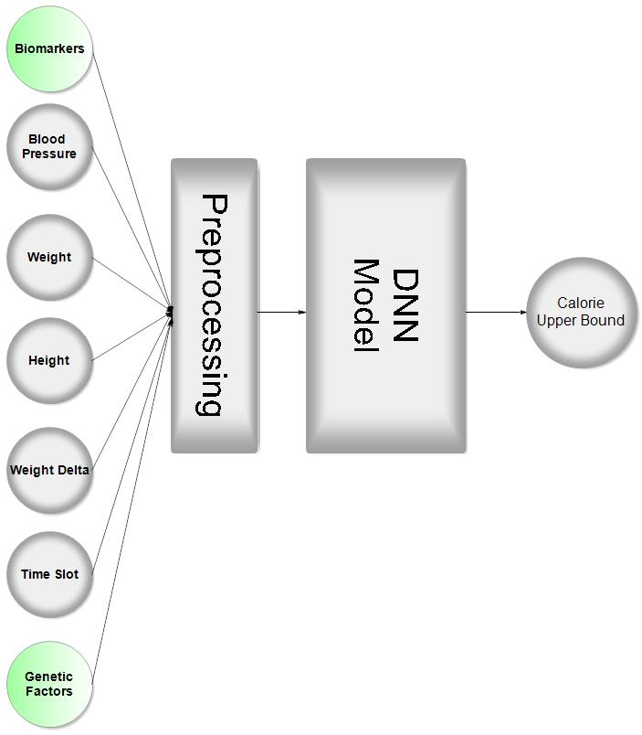

## Developing a Smart Regimen Based on Biomarkers

[**Mojtaba Moghadam**](https://github.com/mojtaba-moghadam) - *MSc of Biosystematics* - University of Zanjan

[**Sepand Haghighi**](https://github.com/sepandhaghighi) - *MSc of Computer Engineering* - Sharif University of Technology

### Introduction	
Periods of voluntary abstinence from food and drink (i.e., intermittent fasting) have been practiced since the earliest antiquity by people around the globe. Books on ethnology and religion describe a remarkable variety of fasting forms and practices. Renewed interest in fasting regimens is evidenced by a plethora of popular press publications and diet recommendations. [*[1]*](#references)

First, we review classic fasting regimens and then propose our method.

### Different Types of Fasts

There are three main types of fasting: [*[1]*](#references)

1. **Complete Alternate Day Fasting**

These regimens involve alternating fasting days (no energy-containing foods or beverages consumed) with eating days (foods and beverages consumed ad-libitum).

2. **Modified Fasting Regimens**

Modified regimens allow for the consumption of 20–25% of energy needs on scheduled fasting days. This regimen is the basis for the popular 5:2 diet, which involves severe energy restriction for 2 non-consecutive days a week and ad-libitum eating the other 5 days.

3. **Time-Restricted Feeding**

These protocols allow individuals to consume ad-libitum energy intake within specific windows, which induces fasting periods on a routine basis. Studies of < 3 meals per day are indirect examinations of a prolonged daily or nightly fasting periods.

### Our Method

Here we will propose a new smart method for calorie restriction based on biomarkers and genetic factors.
We know that diet, weight loss and metabolism have a strong correlation, and three main factors that affect on metabolic rate of humans are genetics, lifestyle, and environment. Our model will try to mix these three factors and suggest an upper bound for calories consumed over a period of time.

#### Model Inputs/Output

**Inputs:**

1. Weight difference
2. Biomarkers
3. Genetic factors
4. Height
5. Weight
6. Blood pressure
7. Physical activity
8. Time slot

**Output:**

Upper bound for calories consumed over a period of time

#### Biomarkers List
There are many biomarkers related to metabolism. Here are **9** biomarkers mentioned in most articles: [*[2]*](#references) [*[3]*](#references) [*[4]*](#references) [*[5]*](#references)

1. Leptin
2. TNF-α
3. IL-6
4. PTX-3
5. Uric acid
7. Blood sugar level 
8. HDL
9. LDL
10. Adiponectin

#### Genetics Factors
Here, we have listed these **4** genes whose effects on the metabolism have been studied in articles. [*[6]*](#references) [*[7]*](#references) [*[8]*](#references) [*[9]*](#references)

1. KLKB1
2. X-11792
3. KNG1
4. MC4R

#### Steps

1. Collecting data from different patients
	1. Weight difference (for each observation)
	2. Biomarkers (by blood test for each observation)
	3. Genetic factors (by blood test for the first time)
	4. Height (one time)
	5. Weight (for each observation)
	6. Blood pressure (for each observation)
	7. Physical activity (for each observation)
	8. Time slot (set for each observation)
2. Preprocessing data
3. Training a well-structured DNN (Deep Neural Network) on these data

If there are enough samples and successful training of this deep neural network, we will reach a model that can suggest an upper bound for calories consumed over a period of time based on biomarkers and genetic factors.         			
The block diagram of this system is shown in the figure.

Fig1. System Block Diagram

#### Advantages

- Suggesting calorie restriction regimen based on biomarkers
- It's possible to increase model accuracy by adding some new biomarkers in the future
- It's possible to increase model accuracy by adding some new genetic factors in the future
- It's possible to increase model accuracy by adding some new samples in the future

#### Disadvantages

- Data collecting

### References

<blockquote>1- Patterson, Ruth E., et al. "Intermittent fasting and human metabolic health." Journal of the Academy of Nutrition and Dietetics 115.8 (2015): 1203.</blockquote>

<blockquote>2- Chen, Xiuping, et al. "TNF‐α, a potent lipid metabolism regulator." Cell Biochemistry and Function: Cellular biochemistry and its modulation by active agents or disease 27.7 (2009): 407-416.</blockquote>

<blockquote>3- Rafaqat, Saira, et al. "Biomarkers of Metabolic Syndrome: Role in Pathogenesis and Pathophysiology of Atrial Fibrillation." Journal of Atrial Fibrillation 14.2 (2021).</blockquote>

<blockquote>4- Moon, Yoo-Sun, Do-Hoon Kim, and Dong-Keun Song. "Serum tumor necrosis factor-α levels and components of the metabolic syndrome in obese adolescents." Metabolism 53.7 (2004): 863-867.</blockquote>

<blockquote>5- Weiss, Thomas W., Harald Arnesen, and Ingebjorg Seljeflot. "Components of the interleukin-6 transsignalling system are associated with the metabolic syndrome, endothelial dysfunction and arterial stiffness." Metabolism 62.7 (2013): 1008-1013.</blockquote>

<blockquote>6- Nicholson, Jeremy K., and John C. Lindon. "Metabonomics." Nature 455.7216 (2008): 1054-1056.</blockquote>

<blockquote>7- Suhre, Karsten, and Christian Gieger. "Genetic variation in metabolic phenotypes: study designs and applications." Nature reviews genetics 13.11 (2012): 759-769.</blockquote>

<blockquote>8- Kastenmüller, Gabi, et al. "Genetics of human metabolism: an update." Human molecular genetics 24.R1 (2015): R93-R101.</blockquote>

<blockquote>9- Huang, Tao, et al. "Dietary protein modifies the effect of the MC4R genotype on 2-year changes in appetite and food craving: the POUNDS Lost Trial." The Journal of Nutrition 147.3 (2017): 439-444.</blockquote>